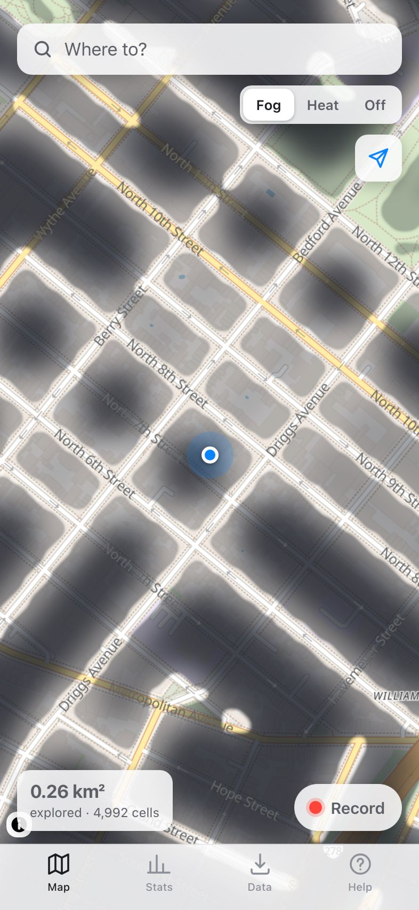
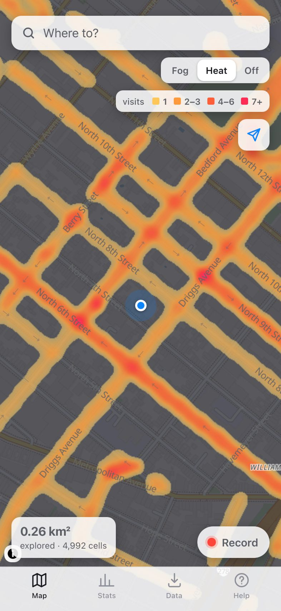
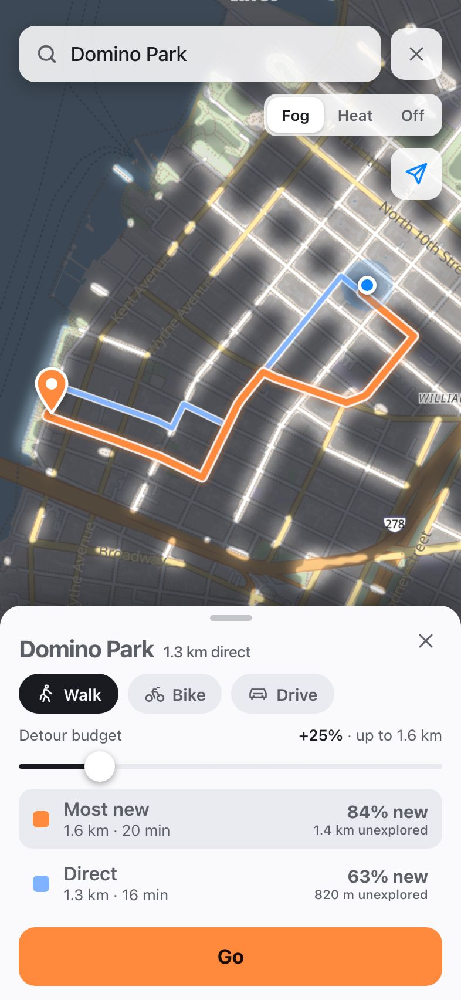

# Unfog

Your Fog of World map, plus the thing it never had: routes that take you somewhere new.

Unfog is a progressive web app for iPhone (Safari → Share → Add to Home Screen). It imports your
Fog of World history, shows where you've been as soft fog or a heat glow, and — the point — routes
you to a destination through as much never-visited street as possible within a detour budget you
choose. Everything stays on your device.

Live: https://data-t3labs.github.io/unfog/ · About page: https://data-t3labs.github.io/unfog/welcome/

| Fog | Heat | Route |
|---|---|---|
|  |  |  |

Screenshots are the real app over sample walks in Williamsburg, Brooklyn (captured by
`tests/e2e/landing/capture.mjs`).

## Features

- Import Fog of World `Sync.zip` / raw Sync files / `.fwss` snapshots, GPX (Apple Health, Strava…),
  Google Timeline exports, and Unfog backups
- Fog and heat layers over an OpenFreeMap basemap, rendered smoothly at full resolution from
  Fog of World's own cell grid (so re-imports line up exactly)
- Novelty routing: walk / bike / drive, detour budget, 2–3 candidate routes with "% new"
- Prebuilt routing graphs for New York City and Metro Vancouver; download any other area on demand
- Record walks in the foreground (screen stays on); export them as GPX for Fog of World's Import folder
- Backup / restore through the iOS share sheet; works offline once installed

## Development

```
npm install
npm run dev          # http://localhost:5173/unfog/
npm test             # vitest
npm run typecheck
npm run build        # dist/
npm run build-graph  # tools/build-graph — see docs/BUILD-PLAN.md §2.4
```

Design + architecture: `docs/BUILD-PLAN.md`. iPhone acceptance: `docs/iphone-checklist.md`.

## Credits

Fog of World tile format after [fog-machine](https://github.com/CaviarChen/fog-machine) (MIT).
Map tiles by [OpenFreeMap](https://openfreemap.org), data © OpenStreetMap contributors. Geocoding by
[Photon](https://photon.komoot.io). Routing graphs built from OpenStreetMap extracts
([BBBike](https://download.bbbike.org)).

MIT License.
