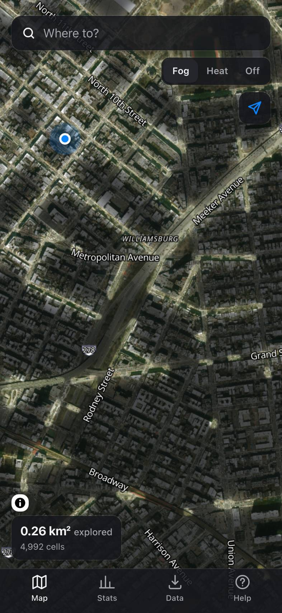
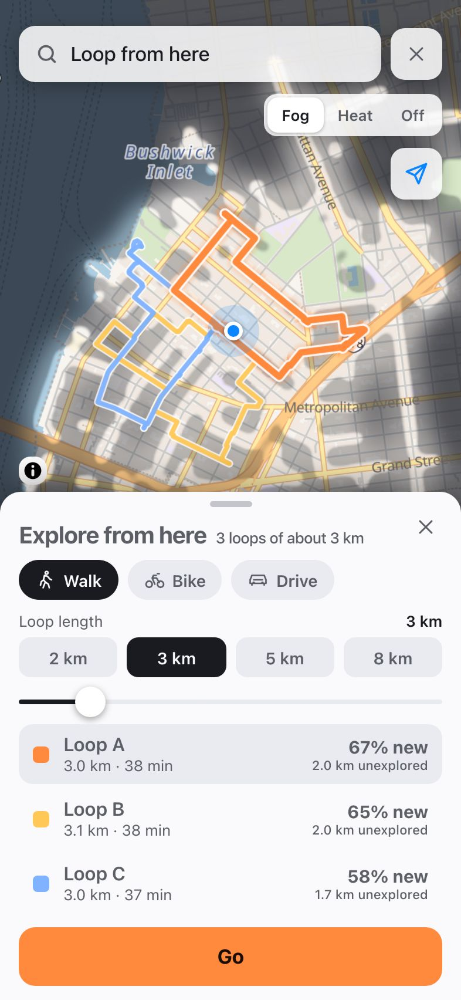

# Unfog

Your Fog of World map, plus the thing it never had: routes that take you somewhere new.

Unfog is a progressive web app for iPhone (Safari → Share → Add to Home Screen). It imports your
Fog of World history, shows where you've been as soft fog or a heat glow, and — the point — routes
you to a destination through as much never-visited street as possible within a detour budget you
choose. Everything stays on your device.

Live: https://data-t3labs.github.io/unfog/ · About page: https://data-t3labs.github.io/unfog/welcome/

| Fog | Heat | Satellite | Route | Loop |
|---|---|---|---|---|
|  |  |  |  |  |

Screenshots are the real app over sample walks in Williamsburg, Brooklyn (captured by
`tests/e2e/landing/capture.mjs`).

## Features

- Import Fog of World `Sync.zip` / raw Sync files / `.fwss` snapshots, GPX (Apple Health, Strava…),
  Google Timeline exports, and Unfog backups
- Fog and heat layers rendered smoothly at full resolution from Fog of World's own cell grid (so
  re-imports line up exactly), over a Map, Dark (night) or Satellite basemap (OpenFreeMap; Esri
  imagery with street names kept)
- Novelty routing: a detour budget and 2–3 candidate routes with "% new"; routes follow paths
  where they exist (streets, footpaths, stairs, either direction) and straight lines where they
  don't, timed at walking pace
- Loop mode ("Explore from here"): pick 2 / 3 / 5 / 8 km (or 1–15 km on the slider) and get up to
  three round trips from where you stand, sorted by unexplored distance
- Hand-off to Google Maps: one tap opens the chosen route or loop in the Google Maps app for
  turn-by-turn walking directions — its corners become checkpoints and long routes open in parts;
  Apple Maps (destination only) and Save GPX for any other app
- Street data that downloads itself: anywhere in North America the streets around you and along
  each route arrive in the background (Wi-Fi or mobile, paused in Low Data Mode) and stay on the
  phone for offline routes (Data → Routing data). Prebuilt regions for New York City, Metro
  Vancouver and Salt Spring Island download whole in one tap; elsewhere in the world "Download
  this area" fetches the streets from Overpass once. Where no streets are known, a route is a
  straight line you can still follow
- Track my movement: one switch in Settings, then Unfog clears the fog as you move whenever it is
  open and on screen (the screen stays awake); sessions export as GPX for Fog of World's Import folder
- Always recording without an iOS developer account: connect Dropbox and Unfog pulls the tiles Fog of
  World changed every time it opens (OAuth PKCE in the browser, cursor-based, no server); or run the
  free Cloudflare Worker in `workers/overland/` and the Overland iOS app logs your location in the
  background for Unfog to pull (one track per day)
- Backup / restore through the iOS share sheet; works offline once installed

## Development

```
npm install
npm run dev          # http://localhost:5173/unfog/
npm test             # vitest
npm run typecheck
npm run build        # dist/
npm run build-graph  # tools/build-graph — see docs/BUILD-PLAN.md §2.4
npm run smoke:live   # opt-in smoke test of the DEPLOYED site — docs/BUILD-PLAN.md §2.7
```

Design + architecture: `docs/BUILD-PLAN.md`. iPhone acceptance: `docs/iphone-checklist.md`.

### Always-recording setup (one time, by whoever deploys)

- **Fog of World via Dropbox** needs a Dropbox app key: [dropbox.com/developers/apps](https://www.dropbox.com/developers/apps)
  → Create app → Scoped access → *Full Dropbox* (an App-folder app cannot see `/Apps/Fog of World`) →
  Permissions: `files.metadata.read`, `files.content.read`, `account_info.read` → Settings → OAuth 2 →
  Redirect URIs: `https://data-t3labs.github.io/unfog/` (and `http://localhost:5173/unfog/` for dev).
  Put the App key in the repo as an Actions **variable** named `VITE_DROPBOX_APP_KEY` (Settings →
  Secrets and variables → Actions → Variables); `.github/workflows/deploy.yml` passes it to
  `npm run build`. Locally: `VITE_DROPBOX_APP_KEY=… npm run dev`. Without it the app still builds and
  Data → Sources says "Not set up yet" with these steps. No secret is involved (PKCE).
- **Overland** needs the receiver: see `workers/overland/README.md` (free Cloudflare account;
  `wrangler login` → `kv namespace create` → `secret put OVERLAND_TOKENS` → `deploy`), then give the
  phone the Worker URL and the token.

## Credits

Fog of World tile format after [fog-machine](https://github.com/CaviarChen/fog-machine) (MIT).
Map tiles by [OpenFreeMap](https://openfreemap.org), data © OpenStreetMap contributors. Geocoding by
[Photon](https://photon.komoot.io). Routing graphs built from OpenStreetMap extracts
([BBBike](https://download.bbbike.org)).

MIT License.
